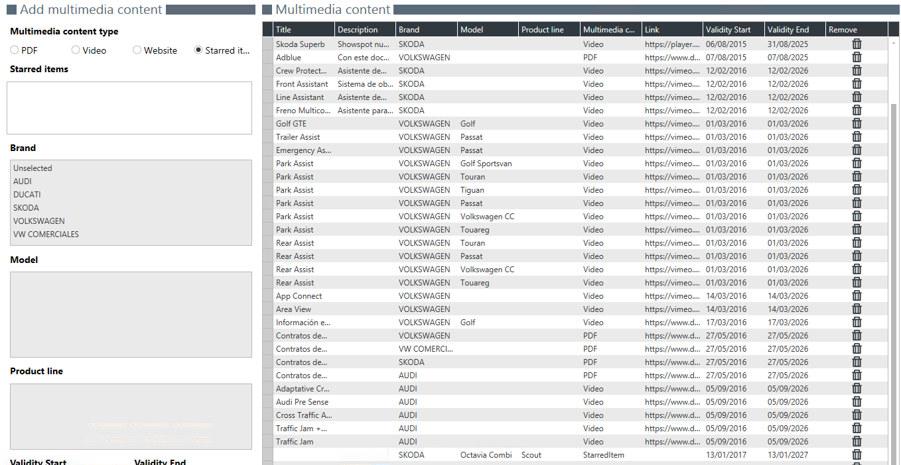

  
  
---  
  
## MULTIMEDIA MANAGER

**Multimedia Manager** lets us add links to multimedia content (pdf, video, web or featured elements) that will then be accesible in the **Multimedia** page, in _First Contact_.  

    
  

## Add multimedia content
  
We add new multimedia content attending to a selectd brand and version. To do so we just have to:  
  
>**1.** Select a type of content.    
 **2.** Write a name and a description for our content.  
 **3.** Add the link to the content.  
 **5.** Select _Model year_, _Model Group_ and _Versión_.    
 **6.** Set _vigency period_.   

 Featured element can only be added to versions.  
 
  

  

