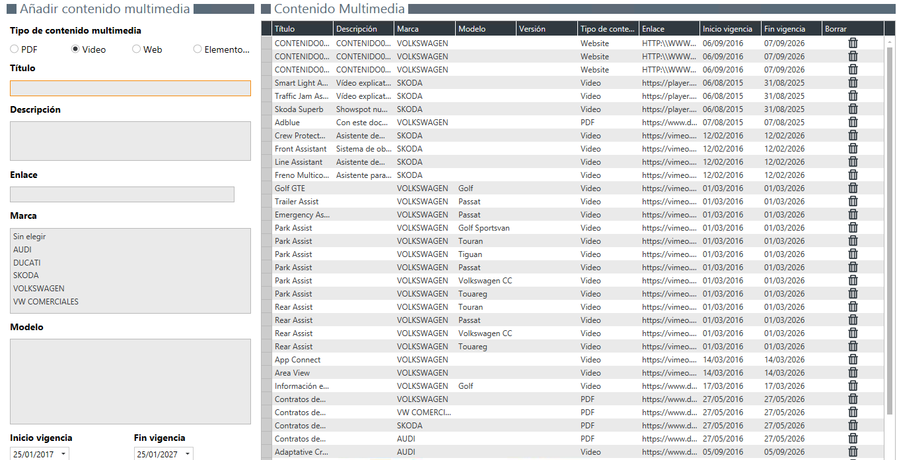

  
  
---  
  
## Gestor multimedia

El **Gestor Multimedia** nos permite insertar enlaces a contenido multimedia (pdf, vídeo, web o elemento destacado) que luego serán accesibles desde la página **Multimedia**, en _First Contact_.   

    
  

## Añadir contenido multimedia  
  
Podemos añadir nuevo contenido multimedia por marca y versión de nuestros vehículos. Para ello, simplemente debemos:    
  
>**1.** Seleccionar el tipo de contenido.    
 **2.** Escribir el nombre y la descripción del contenido.  
 **3.** Añadir el enlace al contenido multimedia.    
 **4.** Seleccionar marca y modelo.  
 **5.** Seleccionar _Model year_, _Grupo Modelo_ y _Versión_.    
 **6.** Establecer el periodo de vigencia.       
  

 A las versiones, únicamente se les puede añadir elementos destacados.
 
  

  

  

