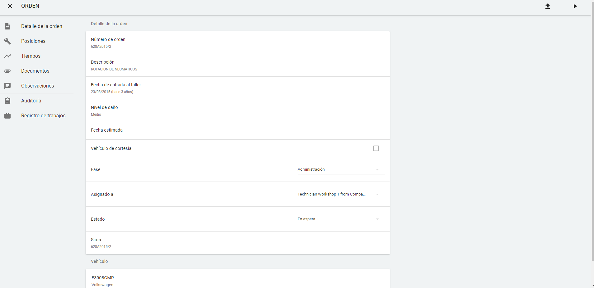

  
   
---   
## Gestionar mis órdenes: el mecánico 
    
El **técnico de taller** comienza a **gestionar las órdenes** a él asginadas y priorizadas por el manager nada más acceder a Skilder. La aplicación le mostrará su _panel de control_ con las órdenes agrupadas por fase:    

    
  

 
  
## Detalle de la orden       
  
El **detalle de la orden** se mostrará al _hacer clic sobre la orden_. 
  

  
  
El **Detalle de la orden** nos permite:  
  
 -  Editar la información de la orden (manager, sólo).     
 - **Actualizar la fase** de la orden.  
 - **Asignar la orden a otro técnico**.  
 - **Cambiar el estado** de la orden. 
 - Asignar vehículo de cortesía. 
 - Modificar tiempos planificados.
 - Introducir **Observaciones** asociadas a la orden.

 -  Activar/Desactivar el contador de tiempo de piques.  
> - Modificar los datos de la orden al imputar el tiempo.  
 -  Cerrar la orden.

 - Archivar, las órdenes que estén en estado *Terminado* para que desaparezcan del panel. Es posible recuperarlas buscando y devolverlas al panel cambiándolas de *Fase*.  
  

  

    

  
  
### Posiciones  
  
**Posiciones** nos muestra la relación de posiciones aplicadas a la orden, por ejemplo _Recambios_ y _Mano de obra_.      
  

  

  
  
### Tiempos   
  
**Tiempos** muestra  información relativa a :  
  
 - **Tiempos imputados** en las fases de la orden.  
 - **Tiempo planificado** y **tiempo restante**.  
 - **Tiempo dedicado por usuario** a la orden.    
 - **Ciclo de la orden**: evolución de la orden en un marco temporal.
  

    
  

  
### Documentos     
  
**Documentos** muestra los documentos añadidos a la orden y la posibilidad de _subir nuevos documentos.  
  

  

  
### Auditoría    
  
**Auditoría** nos permite realizar un seguirmiento de la orden y sus cambios de _estado_, _fase_, _mecánico asignado_, _cambios de mecánico_, entre otros.    
  

  
  
  
### Registro de trabajos    
  
**Registro de trabajos** muestra la relación de trabajos realizados en la orden.
  

  

 
  
   
  
### Imputar tiempo   

**Imputar tiempo** nos permite controlar el tiempo de trabajo en la orden. Para ello tenemos que:  
  
 - Abrir la orden.  
 - Clicar   
  
En todo momento veremos la _comparación entre el tiempo dedicado y el planificado_, dentro del _Detalle de la orden_.  
  
Para **detener la imputación de tiempo** haremos clic en   
   
