  
   
---      
  
   
  
## Gestionar el taller: el manager
  
La gestión del taller de organiza alrededor de los elementos taller:    
  
 - **Órdenes**: gestión de la órdenes del taller a través del flujo de reparación.  
 - **Informes**: consultar los informes del taller (_Value Stream Map_, _Control de tiempos_, _Pases de taller_ y _Rechazos por fase_).  
 - **Usuarios**: gestionar los usuarios del taller.  
 - **Control de calidad**. 
 
  
## Panel de control    
  
  
El **panel de control** nos permite comenzar a gestionar nuestro taller visualizando un conjunto de KPI's  sobre el estado actual del taller:  
  
> - **Estado**: visualizar las órdenes según su estado.  
> - **Bloqueado**: visualizar órdenes bloqueadas y motivo.   
> - **Alertas**: visualizar alertas de las órdenes: _Sin asignar_, con _Fecha de entrega pasada_, con _Tiempo planificado excedido_ y _Técnicos sin órdenes asignadas_.  

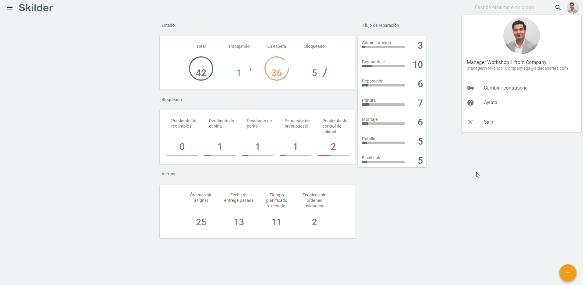      
  
Desde el **Panel de control** podemos _Gestionar las órdenes_ mediante las siguientes tareas:   
  
> - 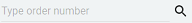 **Buscar por número de orden**.    
> - Consultar el número de **órdenes por estado**: _Trabajandi_, _En espera_. _Bloqueado_, _Sin Asignar_ y _Rechazado_.
> - **Mover las órdenes** de fase (clic y arrastrar).  
> - **Acceder al detalle de la orden** para editar (clic sobre la orden):    
 > - **Consultar las órdenes** de los mecánicos.  
> - **Ver las órdenes asignadas al mecánico** (clic sobre la foto en la orden).  
> -   Crear nueva orden, con varias opciones:  

>>- **Skilder**, el usuario crea una orden indicando todos los datos directamente en Skilder.
>>- **SIMA**, el usuario importa una orden desde SIMA, indicando número de orden y trabajo/s que quiere importar a Skilder. Creándose todos en una misma orden.        
  
### Detalle de órdenes en KPI  
  
Cada **indicador** mostrará, a la derecha, el conjunto de órdenes relaciondas a dicho KPI tras hacer clic.   
  

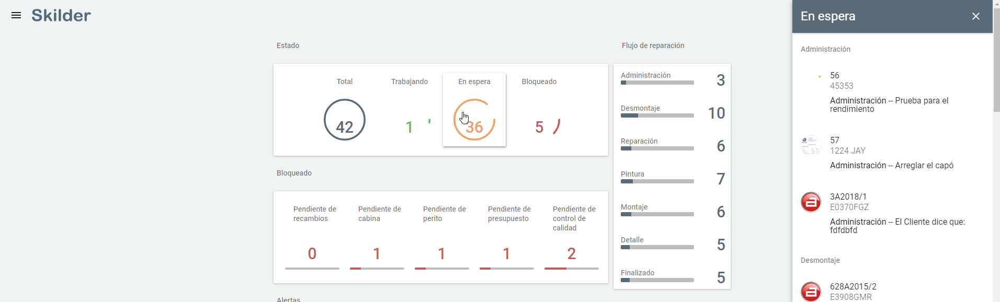

  

  
## Opciones de taller     
  
Desde el _menú lateral_ accederemos a las opciones del taller :   
  

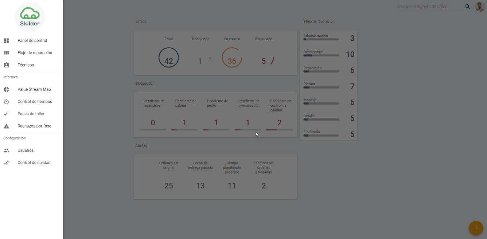  
  
Desde aquí podremos acceder al:  
  
 - **Panel de control**.  
 - **Flujo de reparación**.  
 - **Listado de técnicos**.  
 - **Informes**: _Value Stream Map_, _Control de tiempos_, _Pases de taller_ y _Rechazos por fase_.  
 - **Opciones de configuración**: _Usuarios_ y _Control de calidad_.    
  

  
  
  
  
## Gestión de las órdenes  
  
La **gestión de las órdenes** es distinta para el _manager_ , que gestiona globalmente el taller, y el _mecánico_ que gestiona solamente sus órdenes.  
  
Como **manager** mi gestión consta de las siguientes tareas:  
  
 - **Crear órdenes** de taller.  
 - **Seguir las órdenes** a lo largo del _flujo de reparación_, normalmente lineal pero que puede presentar excepciones.  
  
Durante la gestión de las órdenes, también podremos **bloquear una orden** si fuese necesario.        
  
### Flujo de reparación  
  
El **flujo de reparación** nos permite realizar el _seguimiento de las órdenes_ del taller es accesible para el rol **manager** y muestra una panorámica detallada del estado del taller, permitiendo _priorizar las órdenes_ del taller.  
  
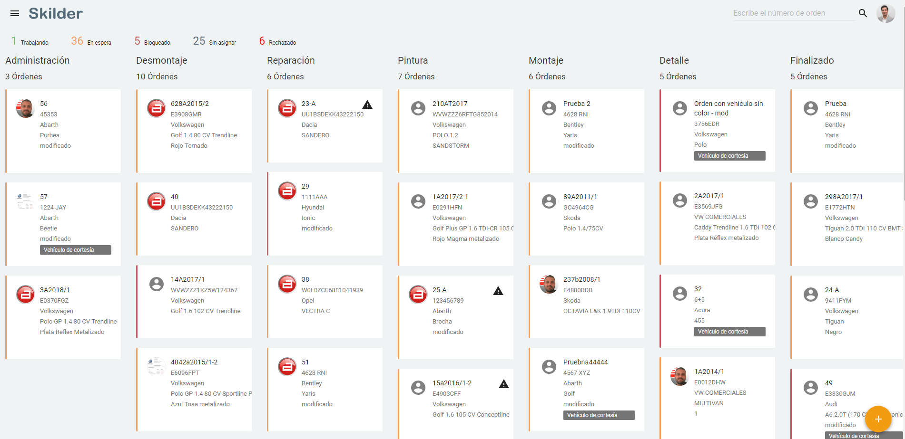  
  
Accedemos al **flujo de reparación** del taller haciendo clic en la etiqueta del mismo nombre:  
  

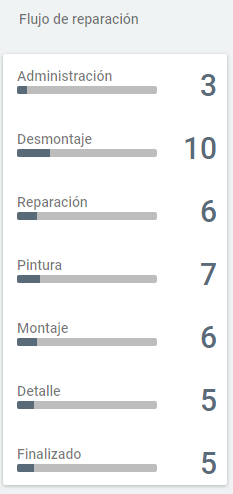 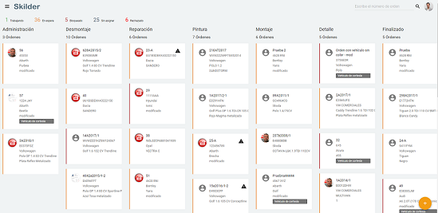      
  

  
### Estados de una orden

Cada fase de la orden puede presentar los siguientes estados:  

> - **En espera**: La orden esta disponible pero actualmente no se está traabajando en ella.  
> - **Trabajando**: Actualmente hay al menos un operario, con su reloj activado, trabajando en la orden.   
> - **Bloqueado**: La orden está bloqueada por algún motivo. 

### Bloquear órdenes: motivos  
  
El **estado de bloqueo** en una orden _anula  tiene una mayor peso que el resto de estados. Por ejemplo, si la orden tiene un reloj corriendo pero se encuentra "Bloqueada", el estado de la orden será "Bloqueado" y no "Trabajando"

La **orden bloqueada** debe tener un _motivo de bloqueo_. Los posibles motivos de bloqueo son los siguientes:    

> - **Pendiente de recambios**  
> - **Pendiente de cabina**  
> - **Pendiente de perito**  
> - **Pendiente de presupuesto**  
> - **Pendiente de control de calidad**         
  
## Crear nueva orden   
  

Desde este botón podemos **crear órdenes**, tanto en **SIMA** como en **Skilder**, completando los datos respectivos de las órdenes.      
    

  
**Crear orden** está disponible desde el _Panel de control_ y _Flujo de reparación_  y nos permite crear órdenes para **SIMA** y **Skilder**, completando los formularios respectivos.  
  
  
### Nueva orden de SIMA  
  

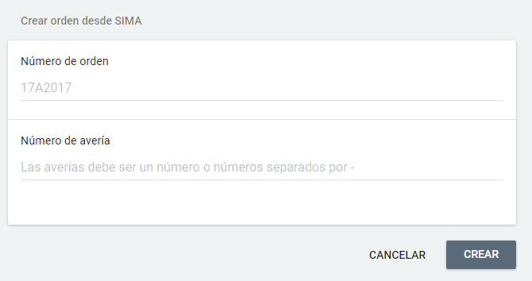    

  
### Nueva orden de SKILDER    
  

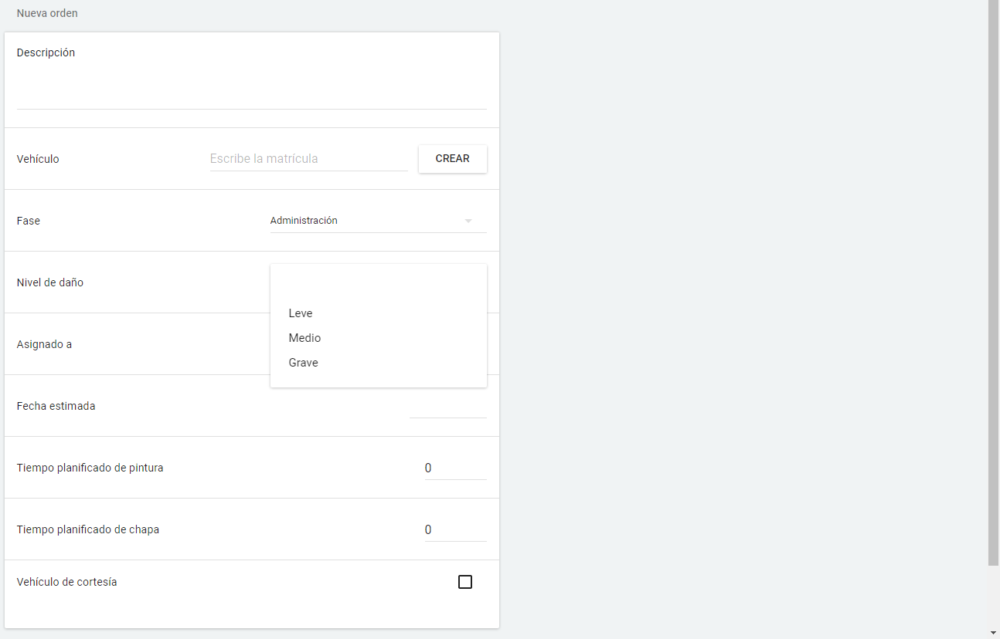          
  
# Órdenes por Estado y Bloqueadas
  
Para gestionar las órdenes podremos comenzar por gestionar las órdenes según su **Estado** o gestionar las órdenes **Bloqueadas**.       
  

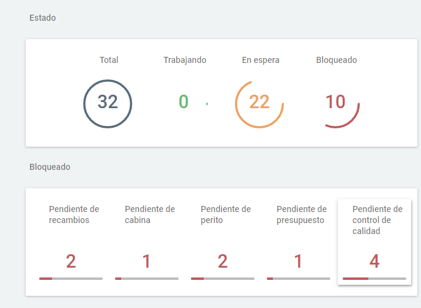  
    

  
En ambos casos debemos hacer:  
  
> **1.** Clic en una subagrupación.  
> **2.**  Clic en una orden.  
> **3.** Modificar la orden abierta.    
  

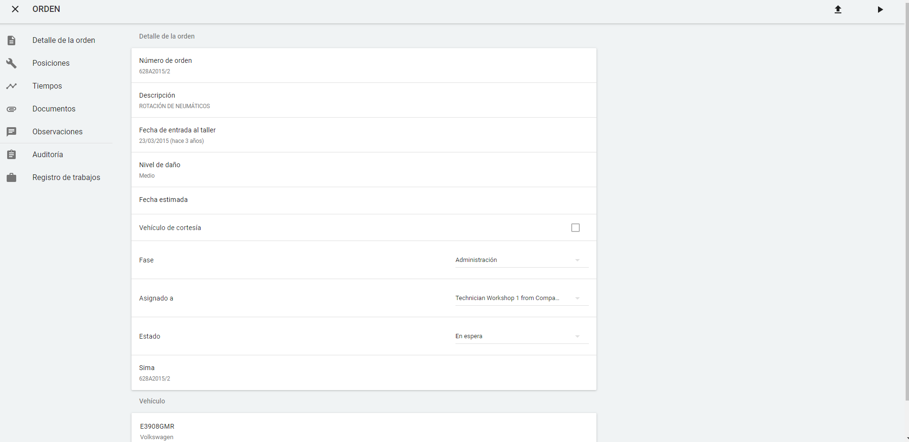      
  
  
## Órdenes en Alertas    
  
**Alertas** nos muestra el total de órdenes que requieren atención especial por darse las siguientes circunstancias:    
  
> - **Órdenes sin asignar**.  
> - Órdenes con **Fecha de entrega pasada**.    
> - Órdenes con **Tiempo planificado excedido**.  
> - **Técnicos sin órdenes asignadas**    
  
### Órdenes sin asignar    
  

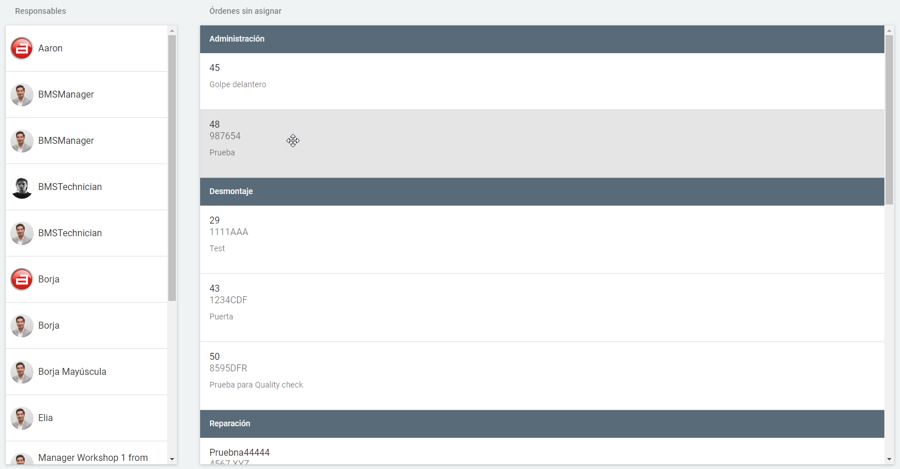

  
  
### Fecha de entrega pasada    
  

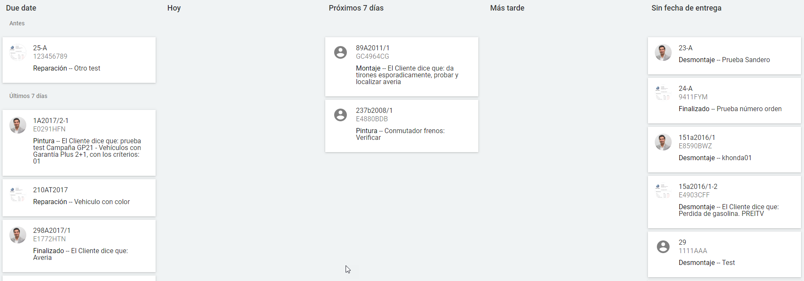

  
### Tiempo planificado excedido    
  

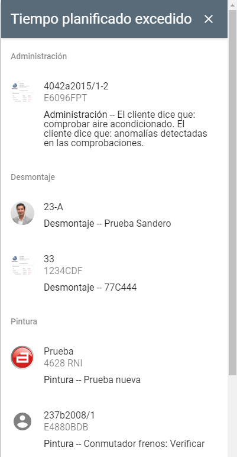

  
  
### Técnicos sin órdenes asignadas  
  

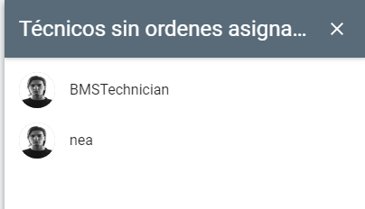      
  
# Configuración de usuarios    
  
Accederemos a la **configuración de usuario** desde el panel derecho en   
  

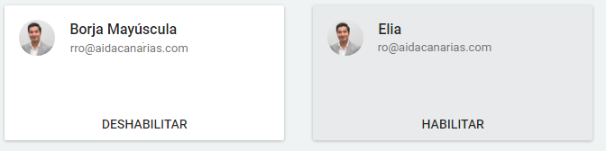  
  
  
## Informes   

### Value Stream Map  
  
**Value Stream Map**, accesible desde la barra de menú lateral, visualizala relación de **horas con valor añadido** y **horas sin valor añadido**.  
  

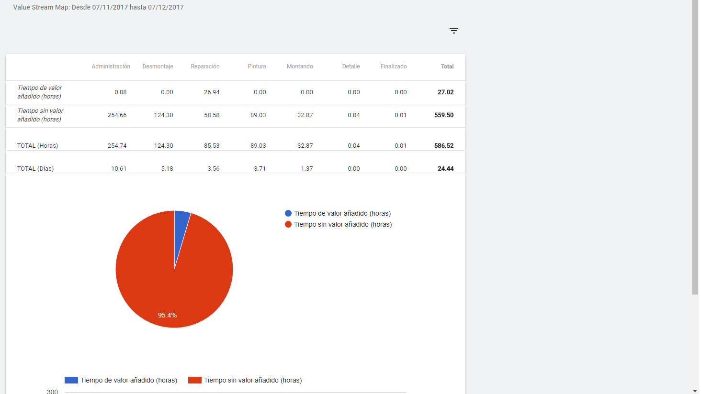  
  
También podremos **filtrar** por **Taller** y **fecha de inicio** y **Fecha de fin**.   
  
  
### Control de tiempos      
  
**Control de tiempos**, accesible desde el menú lateral, visualiza información sobre los tiempos imputados por los operarios.    
  

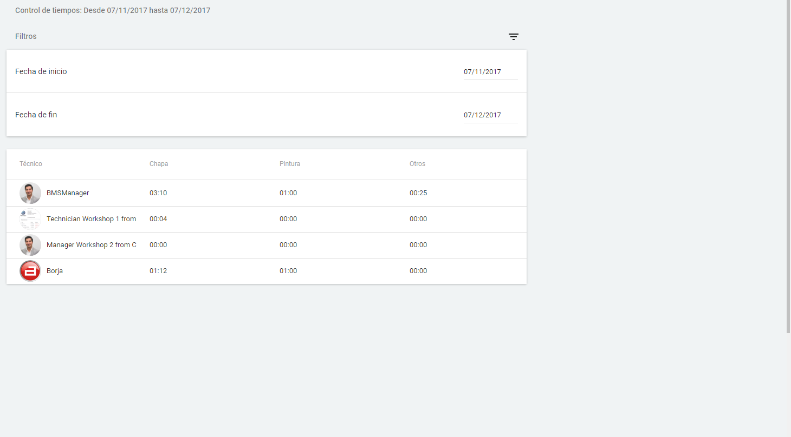    
  
### Pases de Taller    
  
**Pases de taller**, accesible desde el menú lateral, nos permite visualizar  la relación entre _vehículos entrantes_ al taller y _vehículos salientes_, o **Entradas** y **Salidas** del taller.    
  
Además, podremos aplicar los siguientes **filtros** desde el icono  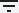:    
  
 -  _Taller_.  
 - _Fecha de inicio_ y _Fecha de fin_  
  

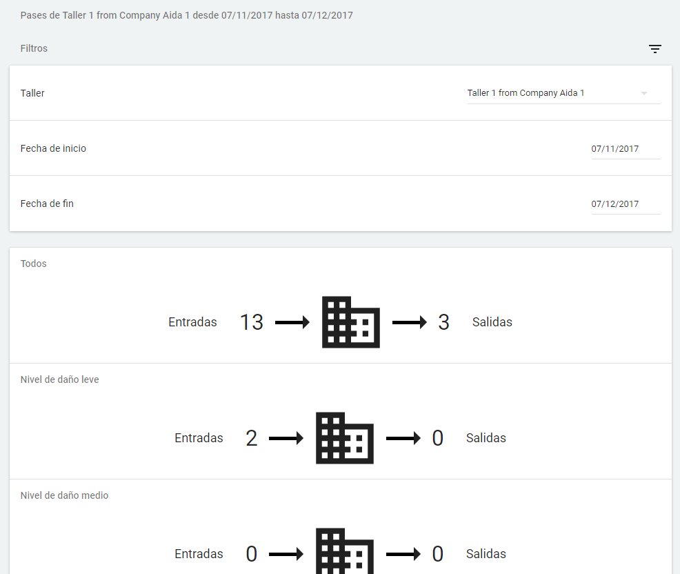    
  
### Usuarios  
  
Desde aquí gestionaremos los usuarios de Skilder pudiendo realizar las siguientes acciones:  
   
 - **Habiltar** / **Deshabilitar** usuarios.  
 - **Crear usuarios**.

### Crear usuario  
  
Para crear un usuario haremos clic en     y completaremos el formulario.  
  

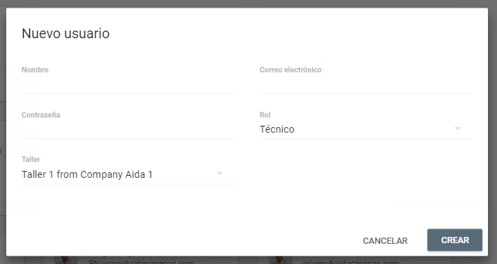  
    
### Habilitar / Deshabilitar usuarios  
  
Para **habilitar/deshabiliar** usuarios basta con hacer clicl sobre la etiqueta _Habilitado/Deshabilitado_ de la ficha del usuarios.    
  

  
 

  

  

  

  

  

  

  

