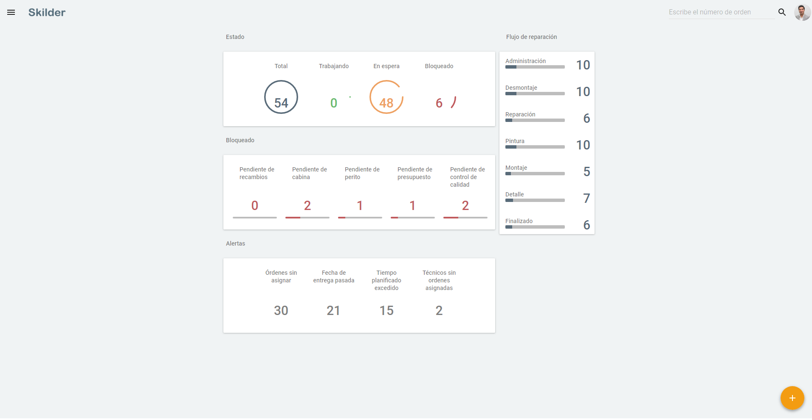
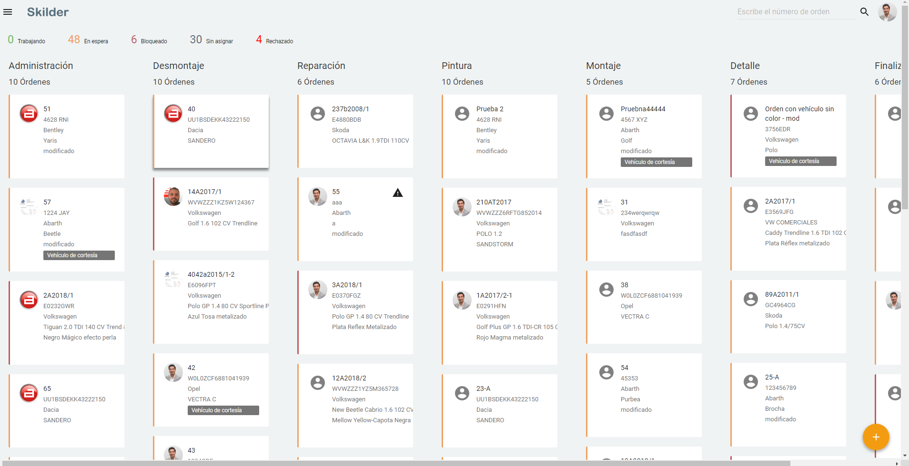
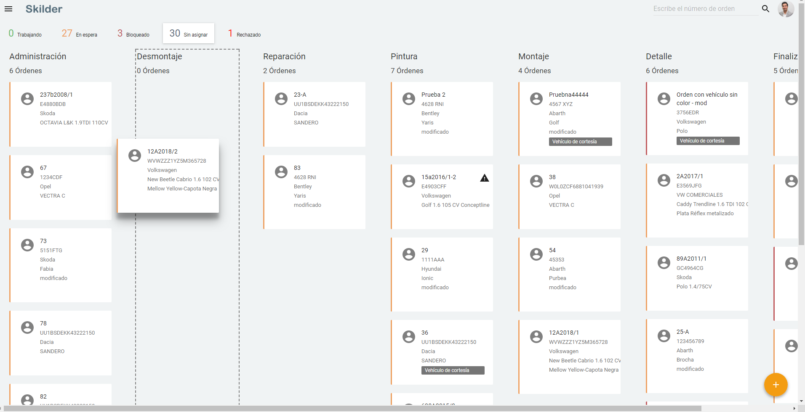
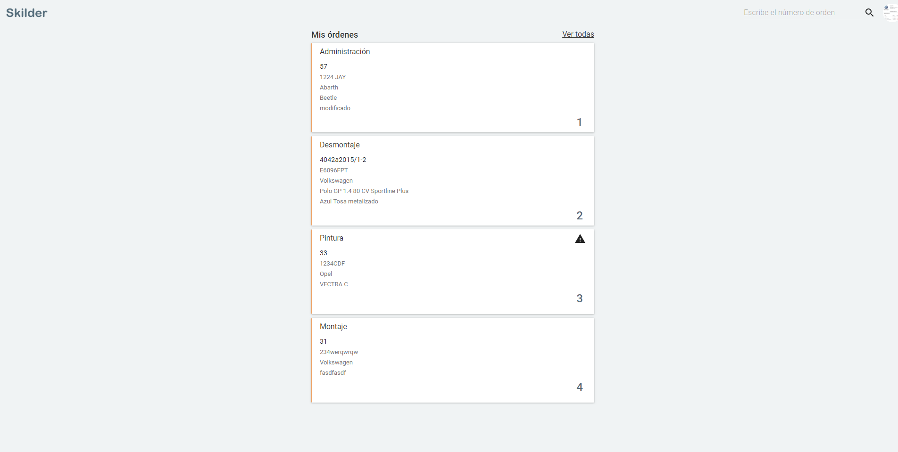
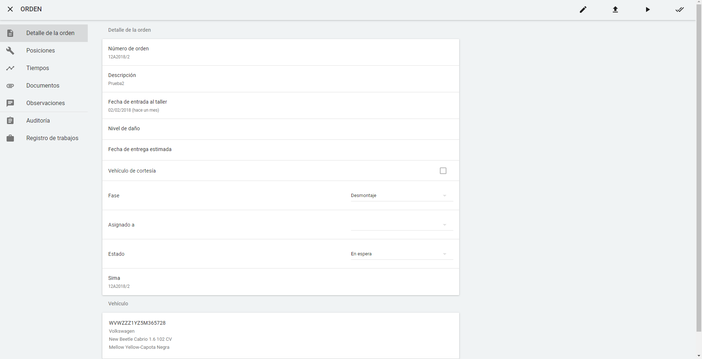
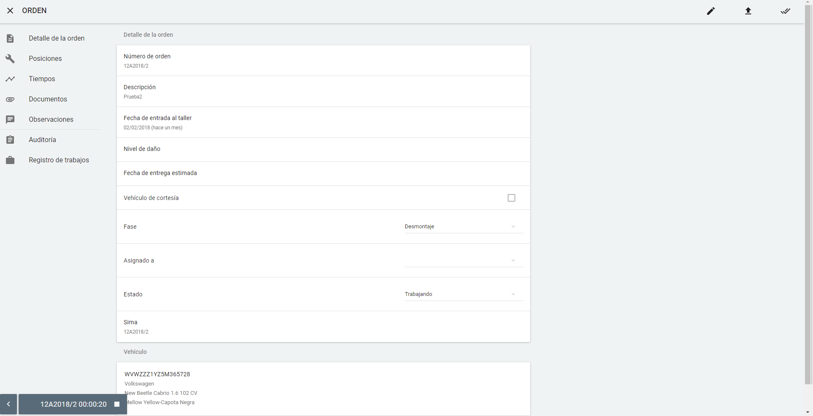
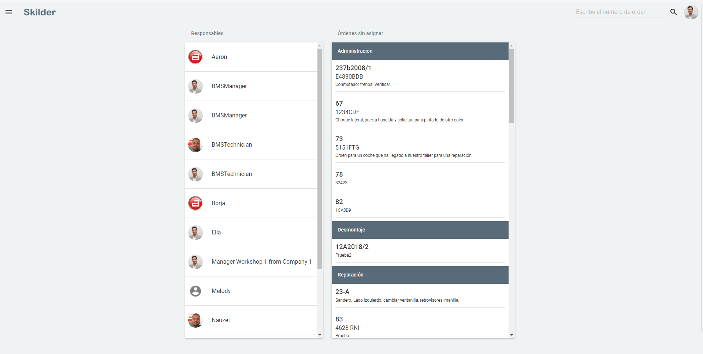
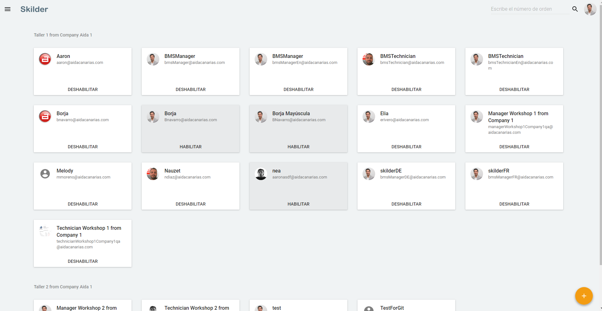

  
  
---  
  
  
# Guía orientativa de Skilder

**Skilder** es una aplicación de [gestión de talleres de chapa y pintura](./Gestionar las ordenes del taller.md) ideado para **incrementar  la eficiencia y los beneficios del taller**. En esta **guía orientativa** encontrarás todo lo que necesitas para poder **empezar a trabajar** con la aplicación.   
  

# Generalidades de Skilder  

## Skilder: aplicación multiplataforma  

**Skilder** es una aplicación **multiplataforma** optimizado para funcionar perfectamente tanto en equipos de escritorio como en tablets.  
 
## Dashboard  

El **dashboard** o **panel de control** es la pantalla inicial que encontramos iniciar la aplicación como **manager del taller**.   
  

  
  
En el **dashboard** encontraremos los principales **avisos** y **alertas** sobre el estado del taller que nos permitirán:    
  
 - **Tomar decisiones según el estado del taller**.  
 - **Detectar cuellos de botella**.  
 - **Incrementar la productividad del taller**.    

  
##  Menú de opciones  

  
**Skilder** agrupa sus funciones principales en el menú de la izquierda, que será nuestra referencia esta guía orientativa para mostrar las funcionalidades de la aplicación.  

## Flujo de reparación  

**Flujo de reparación** es la pantalla donde se muestra **el estado actual del taller** para cada una de las **fases de reparación**.      
  

**Skilder** permite [gestionar las órdenes del taller](./Gestionar las ordenes del taller.md) arrastrastando las órdenes de una fase a otra según necesitemos. Además, también podemos **filtrar por estados** para visualizar solamente aquellas órdenes que más nos interesen.

## Crear una orden
  
Podemos [crear una orden](./Crear una orden de taller.md) desde el  **dashboard** y desde el  desde el **Flujo de reparación**, siempre **pulsando** 
 .

## Priorizar órdenes

El **manager** es el rol del taller que puede **priorizar las órdenes** de los operarios.    
  

   
  
Para **priorizar las órdenes de un técnico** debemos seguir los siguientes pasos:  
 
 > **1.** **Pulsar sobre la imagen del usuario**.  
 > **2.** **Arrastrar en el orden deseado** las órdenes asignadas al usuario.    
  
En el **panel de órdenes del operario** las órdenes **aparecerán ya priorizadas**.    
  

  
 
     
  
  
El **técnico** siempre verá en su panel las órdenes a él asignadas y priorizadas por el manager.

## Visualizar orden  

Para **visualizar una orden** o [acceder al detalle](./Acceder al detalle de la orden.md) sólo debemos **pulsar sobre la orden**, si la tenemos ya a la vista, o **buscar la orden** previamente por su **número de orden** en el menú superior derecha.     
  
 

### Detalle de la orden  
  
Cada **orden** dispone de un [detalle de la orden](./Acceder al detalle de la orden.md) con una **barra de acciones** (cabecera de la orden) y un **menú de opciones** (izquierda) donde se muestran las **secciones de la orden**.     
  

  
 

     Las órdenes pueden ser visualizadas tanto por los manager como los operarios.  
  
  

**BARRA DE ACCIONES DE LA ORDEN**
  
      

La **barra de acciones de la orden** permite:    
  
 - **Editar los datos** de la orden.   
 - **Subir documentos**: se accede a los documentos desde **sección Documentos** del menú izquierdo. Si se hace desde el móvil o tablet, se suben directamente.  
 - **Inicia el reloj de trabajo**.   
 - **Terminar la fase actual** de la orden.  
 - **Realizar el control de calidad**: el **control de calidad** se activa sólo en las **fases configuradas para requerir control de calidad** y cuando el operario ha indicado que está terminada.  
 - **Archivar orden**: al archivar la orden ésta desaparece del flujo de reparación.    
  

## Panel del técnico

El [panel del técnico](./Acceder al panel del tecnico.md) muestra solamente las **órdenes asignadas al técnico**. Las órdenes son **asginadas y priorizadas por el manager**.  

El **técnico** solamente tiene acceso a su panel de órdenes, mientras que **el manager accede a una visión general** de las órdenes del taller.  
  

## Reloj del técnico  

El **reloj del técnico** se mostrará en la parte inferior derecha de la pantalla después de que el operario lo haya activado para **contabilizar el tiempo de trabajo**.     
 

 
  
  
Para **detener el reloj** basta **pulsar el icono de _Stop_**:  

    
  

  
## Órdenes sin asignar    
  
**Órdenes sin asignar** nos muestra todas las **órdenes sin operario asignado** y permite al manager **asignar órdenes**, arrastrándolas al operario elegido.    Para **gestionar las órdenes sin asignar** debemos **pulsar Órdenes sin asignar** dentro de las **Alertas**, en el panel de control.    
  

  

## Fecha de entrega pasada  

Para gestionar las órdenes con **Fecha de entrega pasada** debemos **pulsar Fecha de entrega pasada** en la sección de **Alertas** del panel de control. Aquí veremos todas aquellas **órdenes cuya fecha de entrega ha pasado** agrupadas en cuatro grupos , más otro grupo que muestra las órdenes sin asignar.  
  

## Gestión usuarios: Manager y operarios  

La **gestión de usuarios** se realiza desde la opción **Usuarios** en el menú izquierdo 
  
  
Para **Gestionar los usuarios** debemos:  
  
 > **1.** **Pulsar Usuarios**.  
 > **2.** **Realizar la acción oportuna**:     
 >>  -  **Añadir usuario**: completar con nombre, correo electrónico, contraseña, rol (técnico, manager). taller.  
 >> - **Habilitar / Deshabilitar** usuarios    
  

  
  
  
---  

  
# Consideraciones finales  

 Para cualquier duda o recomendación no dudes en ponerse en contacto con nosotros. Estaremos encantados de atenderte y aprender y mejorar gracias a tu experiencia.

